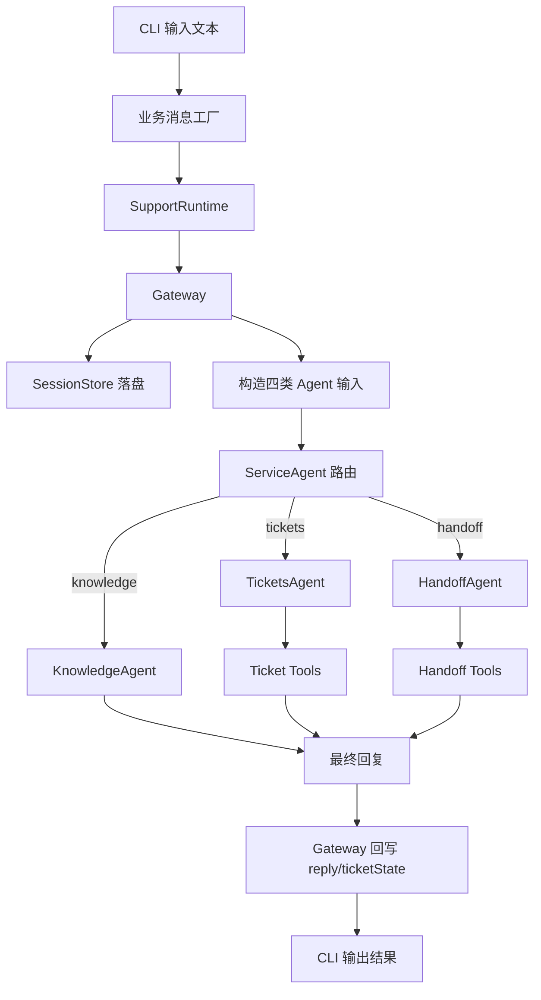
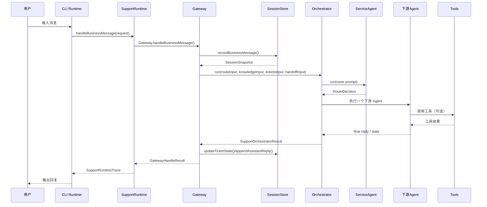

# 基于 OpenClaw 思想抽取的真实信息驱动多智能体客服系统设计与实现

## 摘要

随着大语言模型与工具调用能力的发展，智能客服系统已经从单轮问答逐步走向具备会话状态、任务分流、工具执行与人工协同的复合型系统。OpenClaw 作为一个强调 Gateway 控制平面、会话持久化、系统提示词组装、工具策略与多入口接入的开源智能体系统，为构建复杂智能体应用提供了成熟思路。然而，完整的 OpenClaw 体系覆盖网关协议、插件系统、多渠道消息、沙箱执行、复杂工具权限、会话线程分叉与流式事件总线等能力，直接复用到本科毕设范围中既过重，也会掩盖系统最核心的设计思想。

基于此，本文围绕“从 OpenClaw 中抽取最小可行核心架构”的思路，结合本人对 OpenClaw 的研究笔记与设计思考，设计并实现了一个真实信息驱动的多智能体客服最小系统。该系统并不复制 OpenClaw 的全部能力，而是保留其中最本质、最能形成闭环的主链路：用户消息进入系统后，先被标准化为业务消息，再进入会话存储层形成统一会话快照，随后由 Gateway 构造路由、知识、工单、人工转接四类输入，由 ServiceAgent 完成路由分诊，再由对应下游 Agent 执行知识回答、工单处理或人工转接，最终将回复与状态回写至会话文件，形成完整的真实业务闭环。

本文系统采用 TypeScript 与 Node.js 实现，支持启发式 Mock 大模型模式与 MiniMax 真实模型模式两种运行方式；在会话侧使用文件型 SessionStore 实现持久化，在工单侧使用基于 SQLite 的假数据后端模拟真实工单服务，在人工转接侧生成面向人工坐席的控制台交接包，从而完成“消息驱动—状态积累—分流执行—工具落地—结果回写”的最小可行实现。与传统 Demo 驱动样例不同，本文系统强调“状态只来自当前消息、会话持久化与工具返回结果”，不再依赖预灌场景，使系统更接近真实业务运行语义。

在实现与测试方面，本文重点分析了业务消息工厂、Gateway、SupportRuntime、SupportOrchestrator、SectionBuilder、四类 Agent、知识上下文加载器、工单工具与会话持久化组件的输入输出关系，并通过类型检查与自动化测试验证了新会话纯净性、多轮状态复用、缺失工单信息回询、路由分发正确性以及人工转接闭环等关键能力。研究结果表明，OpenClaw 的核心思想完全可以在保留工程严谨性的同时，被压缩为适用于垂直业务场景的轻量实现；这种“从重型基础设施中提取可落地骨架”的方法，对于本科阶段理解智能体系统架构、构建特定业务原型、探索未来多智能体产品化路线具有较强实践价值。

**关键词：** OpenClaw；多智能体；智能客服；会话持久化；Gateway；Prompt 组装；真实信息驱动

---

# 第一章 绪论

## 1.1 研究背景和意义

近年来，大语言模型在自然语言理解、任务规划和工具调用方面取得了显著进展，促使智能客服系统从传统 FAQ 检索和固定流程树，逐步演变为面向复杂会话、可调用外部服务、可维护会话状态的智能代理系统。在实际客服场景中，用户诉求往往并不是单一类型：有的需要知识答复，有的需要查询工单，有的需要创建或更新处理单，还有一部分涉及投诉、升级或紧急问题，必须转交人工处理。这意味着一个真正可用的客服系统不能仅靠单个问答模型完成，而需要一套能够进行分流、记忆、工具执行和状态回写的整体架构。

OpenClaw 提供了一个非常有启发性的工程范式：它将 Gateway 作为持续存在的控制平面，把消息入口、会话状态、系统提示词、工具权限与代理执行统一编排起来。在对 OpenClaw 源代码与文档进行研究后可以发现，它真正有价值的并不是某一个孤立功能，而是其整体“消息进入后如何被层层转化为可执行智能体输入”的工程思想。对本人而言，这种思想比单纯复现某个界面或某条命令更重要，因为它提供了一种可迁移的方法论：即如何把复杂的 AI 系统拆成入口层、会话层、编排层、能力层和工具层，并用统一数据模型把它们连接起来。

因此，本文工作的意义在于：第一，从一个成熟而复杂的智能体系统中，抽取适合本科毕设实现的最小可行骨架；第二，用一个聚焦客服场景的原型系统，把 OpenClaw 的核心思想转化为当前项目中确实已经存在、可以运行、可以测试、可以解释的代码实现；第三，以“真实信息驱动”替代“演示场景驱动”，使系统的行为由当前消息、历史会话和工具结果共同决定，从而更接近真实业务系统的运行方式。

## 1.2 本课题的问题来源与研究思路

本课题的问题来源并不是“如何从零发明一个智能客服”，而是“如何理解一个大系统的核心架构，并把它抽取成适合自身业务目标的最小实现”。在研究 OpenClaw 的过程中，我逐步形成了一个重要认识：如果只是从表面复制命令行、界面或若干工具调用，最终得到的往往只是一个庞大系统的碎片；真正值得学习的是其底层思维模型，即消息如何进入、上下文如何构造、智能体如何分工、状态如何落盘、结果如何回写。

基于这一认识，本文没有选择直接复刻 OpenClaw 的 WebSocket 控制平面、插件机制、多渠道通信和复杂工具权限链，而是把注意力集中在以下四个最关键的问题上：其一，如何定义“真实业务消息”这一最小输入单位；其二，如何让消息在进入系统前后都拥有稳定可复用的会话状态；其三，如何把一个统一会话快照展开成多个不同 Agent 所需的 Prompt 输入；其四，如何用最简洁的调度逻辑，实现知识、工单与人工转接三类客服路径的闭环。

因此，本文系统的价值并不在于功能绝对丰富，而在于结构明确、链路完整、状态真实、测试可验证。它是一个对 OpenClaw 设计思想进行抽象与压缩后的业务型实现，也是后续扩展为 HTTP 服务、多渠道接入和真实后端系统的基础骨架。

## 1.3 本课题研究内容

### 1.3.1 研究目标

本文的研究目标是设计并实现一个基于 OpenClaw 核心思想抽取的多智能体客服 MVP，使其具备如下能力：

1. 能够把用户输入统一转换为标准业务消息，而不是直接把裸文本送入模型；
2. 能够对消息进行持久化，形成真实可复用的会话状态；
3. 能够根据最新用户诉求，在知识回答、工单处理和人工转接之间做单路由决策；
4. 能够将路由后的任务交给相应 Agent 处理，并通过工具执行产生最终结果；
5. 能够将结果和业务副作用回写到会话层，使下一轮对话建立在真实历史之上；
6. 能够同时支持 Mock LLM 与真实 LLM，以兼顾系统验证和真实体验；
7. 能够通过自动化测试证明该系统目前已经实现的核心功能。

### 1.3.2 研究内容

围绕上述目标，本文主要完成了以下研究内容：

第一，研究 OpenClaw 的 Gateway、Agent Loop、System Prompt、Session 与 Tool Policy 等核心概念，梳理出其最能支撑客服场景的共性机制。第二，基于这些机制，建立适用于客服业务的简化数据模型，包括 `GatewayBusinessMessageRequest`、`SessionSnapshot`、`RouteDecision`、`KnowledgeAnswerPlan`、`TicketActionPlan` 与 `HandoffPlan` 等。第三，设计多层架构，将系统分为 CLI 输入层、业务消息工厂、SupportRuntime 总装层、Gateway 入口层、SessionStore 持久化层、SupportOrchestrator 编排层、四类 Agent 能力层与工具层。第四，实现知识上下文加载、工单查询/创建/更新、人工转接信息打包等关键能力。第五，通过测试与多轮会话验证系统由“Demo 驱动”转向“真实信息驱动”的效果。

### 1.3.3 技术路线

本文采用“源系统研究—概念抽取—最小实现—链路验证”的技术路线。

首先，对 OpenClaw 文档与源代码进行研究，重点关注 Gateway 控制平面、系统提示词拼装、Agent 运行流程、会话持久化与工具策略五条主线。其次，将这些思路映射到客服业务，保留其中对系统闭环最关键的部分，舍弃当前阶段不必要的复杂能力，如多渠道接入、插件生态、沙箱、安全审批与流式事件总线。再次，在当前项目中用 TypeScript 实现精简版架构，使每个模块的输入输出都清晰可见。最后，借助 Mock LLM、MiniMax 真实模型与 Vitest 自动化测试，对系统进行功能验证与行为分析。

从技术方法论上看，本文不是从业务需求直接堆砌功能，而是先理解大系统中的“稳定骨架”，再围绕这个骨架填入当前项目真正已有的代码实现。这种路线更适合毕设阶段的研究与实现统一，也能够避免系统设计与代码现实脱节。

## 1.4 论文结构安排

### 1.4.1 各章节内容概述

本文共分为六章。

第一章为绪论，说明研究背景、研究意义、研究目标、研究内容和技术路线。第二章为相关理论与关键技术，主要介绍多智能体客服系统、会话状态管理、Prompt 分块组装、工具调用与 OpenClaw 核心思想。第三章为系统总体设计，围绕需求、总体架构、模块划分与运行流程展开。第四章为系统实现，详细说明当前项目已完成的关键代码实现，包括 SupportRuntime、Gateway、SessionStore、SectionBuilder、四类 Agent 与工具层。第五章为系统测试与结果分析，结合现有自动化测试与运行结果评估系统功能、稳定性与当前不足。第六章对全文工作进行总结，并提出后续扩展方向。

---

# 第二章 相关理论与关键技术

## 2.1 相关理论基础

### 2.1.1 基本概念

本文涉及的核心概念包括智能代理、多智能体协作、会话状态、工具调用与系统提示词构造。所谓智能代理，是指能够接收环境输入、根据目标进行判断并输出动作的智能实体。在大语言模型时代，代理不再只是一段固定逻辑，而是“模型推理 + 外部工具 + 状态管理”的组合体。多智能体系统则是把不同角色拆分给多个代理，由它们在统一上下文下完成分工协作。

在客服场景中，多智能体并不一定意味着多个代理同时并行工作，更重要的是不同角色的职责边界是否清楚。例如，路由代理负责判断任务类型，知识代理负责基于已知信息进行回答，工单代理负责与工单系统交互，人工转接代理负责组织升级信息。这样做的好处是角色明确、输出结构明确、便于测试和扩展。

### 2.1.2 理论原理

本文系统遵循“消息驱动状态演化”的基本原理。即每一轮用户输入都被视为一个真实业务事件，该事件先被持久化为系统状态的一部分，再驱动后续的路由判断和工具执行。系统不依赖隐藏的演示上下文，也不通过脚本式预设来决定结果，而是由当前消息、历史会话与外部工具结果共同决定后续行为。

这一原理与 OpenClaw 的 Agent Loop 思想高度一致。OpenClaw 强调一次真实运行应包含消息接入、上下文组装、模型推理、工具调用、结果持久化等完整步骤。本文虽然删除了其中的流式事件、沙箱、安全策略和多通道网关，但保留了“从输入到状态到动作再到回写”的核心闭环。

### 2.1.3 工作机制

本文系统的工作机制可以概括为：用户在 CLI 输入文本后，运行时先把文本与会话身份绑定，生成标准业务消息；业务消息进入 Gateway，并由 SessionStore 先落盘形成 `SessionSnapshot`；随后 Gateway 基于同一快照构造四类 Agent 输入；SupportOrchestrator 先调用 ServiceAgent 产出 `RouteDecision`，再只执行一个下游 Agent；下游 Agent 在结构化 Prompt 约束下生成计划，并在必要时调用工具；最终回复与副作用被回写到会话文件中。

这种机制的关键在于，系统中所有重要模块都围绕统一数据模型协同工作。换句话说，模型不再直接面对“杂乱的上下文字符串”，而是面对由会话、业务目标、共享上下文、工具说明和输出契约共同构成的结构化输入。

## 2.2 关键技术介绍

### 2.2.1 多智能体分层与单路由执行

本文系统采用“先路由、再单执行”的多智能体模式。与多个 Agent 同时回答相比，这种模式更符合客服业务的确定性需求。因为一次客服请求通常只应落入一种主处理路径：要么回答知识问题，要么处理工单，要么升级人工。当前实现中，`SupportOrchestrator` 会首先调用 `ServiceAgent`，根据返回的路由结果决定只执行 `KnowledgeAgent`、`TicketsAgent` 或 `HandoffToHumanAgent` 之一。这种设计既保留了多智能体分工，又避免并发执行引起的复杂协调问题。

### 2.2.2 Prompt 分块组装技术

OpenClaw 的一个重要思想是系统提示词不是手写成大段字符串，而是由多个 section builder 按需组装。本文直接借鉴并简化了这一思想，构建 `SectionBuilder`。在当前项目中，路由、知识、工单、人工转接四种 Prompt 分别由不同预设函数构造，但都共享统一的 section factory 方法。系统可以按需加入“当前用户消息”“最近历史”“共享业务上下文”“当前工单状态”“知识候选”“工具说明”和“输出格式契约”等信息。

这种做法的好处有三点。第一，Prompt 的结构可解释，可追踪，不再是不可维护的长文本拼接。第二，不同 Agent 能共享相同的上下文构件，却保留各自角色差异。第三，后续如果需要加入更多业务上下文，只需扩展对应 section，而无需重写所有 Prompt。

### 2.2.3 会话持久化与业务状态回写

会话持久化是智能客服系统区别于单轮问答系统的关键。OpenClaw 采用 `sessions.json` 与 transcript JSONL 的分层会话方案，服务于更复杂的多入口、多线程与长周期运行需求。本文面向 MVP 场景，将其抽取为“每个会话一个 JSON 文件”的简化实现：`FileSessionStore` 以 `conversationId` 作为文件名，把 transcript、ticketState、sharedContext、创建时间与更新时间统一保存下来。用户消息先写入会话，再进入后续流程；系统回复与工单状态在流程结束后再回写。

这种设计非常适合最小系统：一方面，它保留了 OpenClaw 中“状态先于推理”和“状态服务于下一轮”的核心思想；另一方面，它避免了在毕设阶段引入复杂的索引表、并发锁和跨会话解析成本。更重要的是，它把系统行为变成可观察对象，开发者可以直接打开 JSON 文件检查系统在每一步到底记住了什么。

## 2.3 相关系统结构分析

### 2.3.1 OpenClaw 核心结构模型

结合源代码与文档，可以把 OpenClaw 的核心模型理解为“控制平面 + 会话状态 + 系统 Prompt + 工具策略 + 代理循环”五层耦合结构。Gateway 负责统一接入与调度，会话服务负责持久化状态，系统 Prompt 负责把各种上下文压缩成模型可理解输入，工具系统负责把模型意图转化为可执行动作，而 Agent Loop 则负责串起一次真实运行。

这种结构的优势是高度通用，但对本科毕设而言也明显偏重。因为一旦完整引入，就必须同时面对协议握手、会话线程管理、多渠道消息格式、工具权限管线、沙箱和流式订阅等大量非核心问题。因此，本文选择只保留最能形成业务闭环的部分。

### 2.3.2 本文系统的抽取式结构模型

在当前项目中，OpenClaw 被抽取为一个更轻的模型：CLI 作为当前唯一入口；`createRuntimeBusinessMessage()` 作为业务消息标准化层；`createSupportRuntime()` 作为总装入口；`Gateway` 作为内部业务入口；`FileSessionStore` 作为统一状态源；`SupportOrchestrator` 作为调度器；四类 Agent 作为能力层；`SectionBuilder` 作为 Prompt 编排层；Mock 或 MiniMax 作为模型层；Ticket/Handoff 工具作为动作层。

换言之，本文并不是“抄写 OpenClaw”，而是把它重新翻译成一套聚焦客服业务、能被完整解释的最小架构。这种抽取的结果是：系统虽然更小，但其运行逻辑依然与 OpenClaw 的核心机制保持一致。

### 2.3.3 系统特点分析

当前系统具有以下几个鲜明特点。

其一，真实信息驱动。系统不再依赖 Demo 预置背景，新会话确实从空状态开始。其二，统一状态源。所有 Agent 都基于同一个 `SessionSnapshot` 工作，避免上下文分裂。其三，结构化 Prompt。系统把上下文分块表达，使推理过程更可控。其四，业务闭环明确。用户输入、工单状态、知识上下文与人工转接结果都可回写到会话层。其五，工程可测试。当前项目已经围绕新会话、多轮会话、路由分发与缺失工单处理等核心行为建立自动化测试。

与此同时，系统也保留了 MVP 的边界：尚未实现 WebSocket Gateway、多渠道接入、插件机制、复杂权限控制、流式输出和真实知识检索。这种有意识的“减法”正是本文研究的一部分，即只保留当前阶段真正必要且已经完成实现的内容。

---

# 第三章 系统总体设计

## 3.1 系统需求分析

### 3.1.1 功能需求

根据客服业务场景与当前项目实现，系统至少需要满足以下功能需求。

第一，能够接收用户消息并生成统一业务请求对象。第二，能够在会话层保存用户消息、系统回复与当前工单状态。第三，能够对用户请求进行路由分诊。第四，能够完成三类主要业务能力：知识回答、工单查询/创建/更新、人工升级。第五，能够在每轮结束后把结果写回会话，为下一轮提供真实上下文。第六，能够支持 Mock 模式与真实模型模式，方便调试与演示。

从代码现状看，这些需求已经分别对应到了 `gateway-chat-runtime`、`business-message-factory`、`session-store`、`support-orchestrator`、四类 Agent、`heuristic-mock-support-llm`、`minimax-client` 等模块中，说明系统功能设计与代码实现基本一致。

### 3.1.2 性能需求

作为一个当前阶段的 MVP 系统，本文并不追求大规模并发性能，而是强调单会话链路的正确性、可重复性与可调试性。因此，本系统的性能需求主要体现在以下方面：

1. 单轮消息应能稳定完成“入库—路由—执行—回写”的全链路；
2. 多轮会话应能持续复用历史状态而不出现上下文污染；
3. Mock 模式下应便于快速验证系统逻辑；
4. 真实模型模式下应保持接口抽象一致，不因模型切换破坏主链路；
5. 会话存储应足够简单，便于定位错误与复盘系统行为。

### 3.1.3 安全与稳定性需求

虽然本文系统未实现 OpenClaw 全量安全体系，但仍需要满足基本稳定性需求。首先，空消息输入应被拒绝，避免无效调用。其次，TicketsAgent 在缺少 `ticketId` 时不能执行错误更新，而应引导用户补充信息。再次，新会话不应携带历史 Demo 状态。最后，模型输出必须符合 JSON 结构，才能被解析为路由或计划结果。

这些约束在当前代码中都得到了体现。例如，多个 Agent 在执行前都会验证 `latestUserMessage` 非空；TicketsAgent 在更新工单前会检查是否存在 `ticketId`；SupportRuntime 的测试也专门验证了新会话不带默认工单状态。

## 3.2 系统总体架构设计

### 3.2.1 系统结构设计

系统总体结构可概括为“输入适配—状态构建—任务分流—能力执行—结果回写”五段式架构。其中文本输入由 CLI 接收，会话身份与消息文本在消息工厂处合并为标准业务消息；业务消息进入 Gateway 后先写入会话存储，再由 Gateway 构造四份 Agent 输入；SupportOrchestrator 基于 ServiceAgent 的路由结果选择一个下游 Agent；下游 Agent 在结构化 Prompt 和工具约束下完成任务；结果最终写回会话层。

### 3.2.2 系统功能模块划分

根据当前项目的源代码实现，系统可以划分为七个模块。

1. **运行入口模块**：包括 CLI 运行时与消息工厂，负责输入接收和业务请求标准化。
2. **总装模块**：`SupportRuntime` 负责组装 Gateway、SessionStore、Orchestrator、Agent、工具与模型客户端。
3. **会话模块**：`FileSessionStore` 负责持久化 transcript、ticketState 与共享上下文。
4. **入口编排模块**：`Gateway` 负责会话写入、Agent 输入构造和结果回写。
5. **调度模块**：`SupportOrchestrator` 负责先路由再单执行。
6. **能力模块**：包括 `ServiceAgent`、`KnowledgeAgent`、`TicketsAgent` 和 `HandoffToHumanAgent`。
7. **工具与模型模块**：包括知识上下文加载器、Fake SQL Ticket Tools、Handoff Tools、Mock LLM 与 MiniMax 客户端。

### 3.2.3 系统运行流程

系统运行流程具有明显的顺序性。为了与 OpenClaw 的 Agent Loop 思维保持一致，当前实现坚持“先状态后推理”的原则。其典型时序如下：

## 3.3 系统硬件设计（若有硬件）

### 3.3.1 硬件选型

本文系统为纯软件系统，不涉及专用硬件设计。当前开发与测试环境运行于个人计算机之上，主要依赖 Node.js 运行时与本地文件系统。

### 3.3.2 硬件结构设计

由于本系统尚未接入物理终端、边缘设备或专用服务器，因此不存在独立的硬件结构设计问题。当前实现默认运行在开发机环境中。

### 3.3.3 硬件连接方案

本文系统没有硬件连接方案。后续若扩展到移动端、消息渠道节点或独立部署环境，可在此基础上继续设计网络拓扑与服务接入方式。

## 3.4 系统软件设计

### 3.4.1 软件架构设计

软件架构的核心思想是“把复杂系统拆为若干可验证的窄职责模块”。当前项目中，CLI 只负责会话输入输出；Runtime 只负责总装与调用；Gateway 只负责状态接入与结果回写；Orchestrator 只负责路由后的单分发；Agent 只负责结构化计划生成；Tools 只负责执行具体业务动作。这样的拆分使每一层都可以单独测试，也便于说明系统设计与源代码之间的对应关系。

### 3.4.2 软件模块设计

模块设计遵循以下原则：

第一，所有跨模块传递的数据都尽量使用显式类型定义。第二，所有 Agent 共用统一的 SectionBuilder 机制，但保留各自的角色提示与输出契约。第三，会话层向上只暴露 `SessionSnapshot` 这种统一视图，而不要求上层直接处理底层存储细节。第四，模型层以 `LlmClient` 抽象统一接口，从而让 Mock 与 MiniMax 可以无缝替换。第五，工具层通过受限接口暴露能力，避免下游 Agent 直接操作底层仓储。

### 3.4.3 程序流程设计

程序流程的关键点有三：一是消息标准化，二是状态优先写入，三是结果闭环回写。与传统 Demo 系统相比，当前实现取消了默认历史和默认工单的注入，使每轮对话的语义都来自真实状态来源。也正因为如此，本系统更适合后续扩展为真实业务入口。

---

# 第四章 系统实现

## 4.1 系统开发环境

### 4.1.1 硬件环境

本系统当前在 macOS 开发环境下完成编码与验证，运行依赖个人计算机本地资源，不依赖专用服务器或 GPU 集群。

### 4.1.2 软件环境

系统采用 Node.js 作为运行时，使用 TypeScript 作为主要开发语言，项目采用 ESM 模块方式组织代码。测试框架为 Vitest，脚本入口包括 `test`、`typecheck`、`demo:gateway` 与 `chat:gateway`。其中 `chat:gateway` 对应交互式会话入口，更贴近当前系统的实际使用方式。

### 4.1.3 开发工具

开发过程中主要使用 VS Code、TypeScript 编译器、Vitest、SQLite 假数据后端以及基于 `fetch` 的 MiniMax 兼容客户端。对于当前阶段的毕设实现而言，这套工具链足以支撑结构设计、功能开发、自动化测试与行为验证。

## 4.2 系统功能实现

### 4.2.1 真实运行时与业务消息入口实现

系统从 CLI 到业务消息的这一段，是“真实信息驱动”思想落地的第一步。当前项目中，`createGatewayChatRuntime()` 负责生成会话运行器，它会维护 `conversationId`、`customerId`、`senderId`、`channel` 和 `turnNumber` 等运行时身份信息。每当用户输入一条新消息时，运行时会调用 `createRuntimeBusinessMessage()`，把会话身份、消息文本、消息 ID 与时间戳打包成统一的 `GatewayBusinessMessageRequest`。

这一设计很重要，因为它明确了系统中的最小业务单位不是一段裸文本，而是一条具有发送者、会话、渠道和时间语义的业务消息。正是由于有了这一层标准化，系统未来才能从 CLI 平滑扩展到 Web、IM 渠道或 HTTP 接口，而不必重写后续逻辑。

### 4.2.2 SupportRuntime 与 Gateway 总装实现

`createSupportRuntime()` 是当前系统的总装入口。它会统一初始化 SessionStore、Fake SQL Ticket Tools、Handoff Tools、ServiceAgent、KnowledgeAgent、TicketsAgent、HandoffToHumanAgent、SupportOrchestrator 与 Gateway，并根据配置选择 Mock LLM 还是 MiniMax 客户端。完成总装后，对外只暴露两个接口：`handleBusinessMessage()` 与 `close()`。

在调用 `handleBusinessMessage()` 时，Gateway 会先通过 `buildSharedAgentContext()` 根据渠道能力、客户资料、业务策略与会话摘要构建共享业务上下文，再把这条消息写入 SessionStore，获得统一的 `SessionSnapshot`。随后，Gateway 基于同一快照构建四类 Agent 输入，调用 Orchestrator 获得结果，并在 Tickets 路径下更新会话中的 `ticketState`，最后把 Assistant 回复再次写回会话层。至此，一轮请求闭环完成。

这一实现体现了本文最核心的一个设计原则：Gateway 不直接“回答问题”，而是负责把消息转化为统一内部状态，并为后续推理准备一致的数据视图。它在当前系统中的地位，与 OpenClaw 中 Gateway 作为控制平面入口的思想是一致的，只是大幅压缩了功能边界。

### 4.2.3 会话持久化与真实状态复用实现

`FileSessionStore` 是当前项目中最具工程价值的模块之一。它使用“每个会话一个 JSON 文件”的方式保存所有重要状态，包括 transcript、ticketState、sharedContext、createdAt 和 updatedAt。`recordBusinessMessage()` 在会话不存在时创建新记录，在会话存在时追加用户消息；`appendAssistantReply()` 追加系统回复；`updateTicketState()` 则专门负责回写工单副作用。

在会话视图的构造上，系统通过 `toSessionSnapshot()` 将底层记录转换成统一的 `SessionSnapshot`。其中 `latestUserMessage` 表示当前用户消息，`history` 表示去掉当前消息后的历史对话，`ticketState` 表示当前工单状态，`sharedContext` 则承载用户画像、业务规则与渠道能力等额外信息。由于所有 Agent 都只依赖这个统一视图，因此系统避免了各模块自行拼接上下文造成的信息不一致。

### 4.2.4 Prompt 分块与四类 Agent 实现

在 Agent 侧，当前项目延续了 OpenClaw 的“按 section 组装 Prompt”思想，但把它浓缩为适合客服业务的实现。`DefaultSectionBuilder` 提供四类 Prompt 生成方法，分别服务于路由、知识、工单和人工转接四种场景。每类 Prompt 虽然角色不同，但都共享一套 section factory，包括：任务目标、当前消息、最近历史、共享业务上下文、工单状态、知识上下文、工具说明与输出格式契约等。

路由场景中，`ServiceAgent` 只负责分诊，不直接生成最终客服答复。它会在 Prompt 中加入分类示例，并要求模型以 JSON 返回 `route`、`intent`、`confidence`、`reason` 和 `entities`。知识场景中，`KnowledgeAgent` 只根据预先装配好的知识上下文生成答案，不依赖运行时外部检索。工单场景中，`TicketsAgent` 会先基于当前 `ticketState` 与计划字段决定执行 `query`、`create` 或 `update`。人工转接场景中，`HandoffToHumanAgent` 会生成面向人工坐席的摘要包，并由工具层返回一个控制台可读视图。

这种实现方式与 OpenClaw 的区别在于：OpenClaw 面向通用智能体，Prompt 包含更广泛的工具、安全、Skills、Workspace、Memory 与 Runtime 信息；本文则针对客服业务只保留必需信息，使 Prompt 更窄、更清晰，也更适合教学与分析。

## 4.3 系统核心算法实现（若有）

### 4.3.1 算法原理

本文系统虽然不是传统意义上的数值算法系统，但其核心仍然是一套明确的“结构化推理算法”。可以将其概括为三步：第一步，把业务消息转化为统一会话快照；第二步，把统一快照投影成多个角色专属 Prompt；第三步，根据路由结果选择唯一执行链路，并将执行结果回写状态。这本质上是一种“状态驱动的单路由多智能体执行算法”。

### 4.3.2 算法流程

算法流程如下：

1. 接收业务消息并校验非空；
2. 将消息写入会话存储并生成 `SessionSnapshot`；
3. 构造 `routeInput`、`knowledgeInput`、`ticketsInput`、`handoffInput`；
4. 调用 `ServiceAgent` 生成 `RouteDecision`；
5. 若路由为知识，则执行知识回答；若为工单，则执行工单计划与工具调用；若为人工，则执行人工转接；
6. 收集下游结果，生成最终回复；
7. 若存在工单副作用，则回写 `ticketState`；
8. 将最终回复追加到会话 transcript；
9. 返回 Trace 供 CLI 或测试观察。

这一流程的关键不是“模型如何思考”，而是系统如何通过严格的数据边界与顺序控制，把模型推理纳入一个可重复、可验证的运行框架。

### 4.3.3 算法实现代码分析

从实现层面看，`SupportOrchestrator.run()` 是上述算法的中心。它首先验证四类输入是否共享同一个 `sessionId` 与 `customerId`，以保证上下文一致。然后，系统调用 `ServiceAgent.run()` 获取路由结果，再根据 `routeDecision.route` 只执行一个下游 Agent。对于 Tickets 路径，系统还会在最终回复阶段根据 `TicketActionPlan` 和工具结果进行二次整理，确保当查询不到工单时，回复内容不是伪造结果，而是引导用户补充订单号或工单号。

另一个关键点是 `HeuristicMockSupportLlmClient` 的设计。它并不是简单返回固定字符串，而是根据 Prompt 的 `variant` 与当前 `inputText` 生成对应结构的 JSON。这样一来，即使在 Mock 模式下，系统仍能模拟“路由计划—下游计划—工具执行”的真实链路，从而让测试更有价值。

## 4.4 系统界面设计（若有）

### 4.4.1 系统界面结构

当前项目没有图形界面，而是采用终端交互式 CLI 作为主要交互界面。CLI 结构非常轻：用户输入文本，系统返回一条最终回复；若用户输入 `exit`，则退出会话。对于一个聚焦架构验证的 MVP 来说，这种界面方式足以支撑完整链路展示，也最能体现“系统核心在于架构而非界面”的研究重点。

### 4.4.2 交互流程设计

终端交互流程遵循最小闭环原则。CLI 不直接管理业务逻辑，只负责采集输入、调用 Runtime、打印回复。会话切换通过 `openNewSession()` 实现，新的 `conversationId` 会被重新生成，并将 `turnNumber` 归零。这样的设计能够清楚地区分“新的会话身份”和“同一会话的多轮延续”，从而保持交互语义的清晰性。

---

# 第五章 系统测试与结果分析

## 5.1 系统测试方案

### 5.1.1 测试环境

当前系统测试在本地开发环境中完成，主要依赖 TypeScript 类型检查与 Vitest 自动化测试。测试覆盖了 Runtime、Gateway Chat Runtime、SupportOrchestrator、Ticket Tools、Handoff Console View、SectionBuilder 等关键模块。

### 5.1.2 测试方法

本文采用三类测试方法。第一类是静态类型检查，用于保证各模块数据结构与函数接口的一致性。第二类是单元测试，用于验证特定模块在确定输入下的输出是否符合预期。第三类是链路测试，用于验证一条消息经过 Runtime、Gateway、SessionStore、Orchestrator、Agent 与 Tools 后，能否形成完整闭环。

### 5.1.3 测试指标

由于当前项目定位为 MVP，测试指标主要以功能正确性和状态一致性为核心，具体包括：

1. 新会话是否真正不带 Demo 上下文；
2. 多轮对话是否能复用真实会话状态；
3. 路由是否能正确分发到知识、工单或人工路径；
4. 工单路径在缺少关键标识时是否能给出补充引导；
5. 会话回写后 transcript 数量是否随轮次增长；
6. 新开会话后 `conversationId` 和回合数是否被正确重置。

## 5.2 系统功能测试

### 5.2.1 功能测试过程

从当前测试代码可以看出，系统已经围绕最关键的真实业务语义进行了功能验证。

一是验证“新会话纯净性”。测试构造一条知识问题消息，要求系统在没有任何预设 `history` 和 `ticketState` 的情况下完成知识路由，并确认 `ticketId` 为空、transcript 仅包含用户消息与系统回复两条记录。二是验证“多轮状态复用”。测试先发送工单查询消息，再发送投诉并要求人工处理的消息，检查第二轮是否能基于第一轮累计出的历史继续运行，并正确走到人工转接路径。三是验证“缺失工单信息的回询行为”。当路由强制为工单路径，但用户没有提供足以定位记录的信息时，系统不会伪造工单，而是明确要求补充订单号或工单号。四是验证交互式 CLI 的会话行为，包括默认 `conversationId` 的唯一性、`openNewSession()` 后回合数归零、显式初始会话 ID 能否保留到新会话开启前等。

### 5.2.2 功能测试结果

测试结果表明，当前系统已经实现了预期的最小闭环能力。首先，系统的状态来源已经从 Demo 预灌内容转变为真实消息与持久化会话；其次，工单、知识和人工三条路径都能够在统一架构下被调度与执行；再次，人工转接不仅能返回用户侧确认文案，还能生成面向人工处理者的交接视图；最后，会话持久化机制能够支持多轮上下文累积，从而使系统具备连续服务的基本能力。

## 5.3 系统性能测试

### 5.3.1 性能测试方法

受项目阶段所限，本文尚未进行高并发压测、长会话极限测试或多用户吞吐测试。因此，本节所说的“性能测试”主要是工程层面的轻量观察：Mock 模式下主链路能否稳定快速完成；多轮会话中 transcript 能否稳定增长；模型切换为 MiniMax 后，系统主链路是否仍保持一致；会话文件持久化是否易于读取与调试。

### 5.3.2 性能测试结果

从当前实现和测试结果看，系统在 Mock 模式下具有较好的开发体验与可验证性，能够快速完成从输入到输出的链路闭环。切换为 MiniMax 模式后，调用接口、Prompt 构建与结果解析逻辑保持不变，说明模型层抽象是有效的。会话文件采用单会话单 JSON 的形式，也保证了调试时的可读性与可追踪性。

当然，本文必须如实指出：当前系统尚不具备生产级性能结论。它没有实现 OpenClaw 中那样的队列化串行调度、全局网关并发控制、流式增量输出、上下文压缩、复杂监控与容错机制，因此性能章节的意义主要在于证明“当前骨架是稳定可运行的”，而不是证明“当前系统已适合大规模生产”。

## 5.4 结果分析

### 5.4.1 系统优势分析

综合设计与测试结果，本文系统的优势主要体现在以下几个方面。

第一，架构清晰。每一层职责边界明确，便于解释、调试和扩展。第二，状态真实。新会话不再携带演示背景，多轮对话真正依赖历史会话与工具结果。第三，Prompt 可维护。SectionBuilder 让 Prompt 构建从不可控字符串拼接转化为结构化模块组合。第四，业务闭环完整。知识、工单与人工转接三条核心路径均已实现。第五，可测试性强。系统已经具备围绕核心业务语义建立自动化测试的能力。

从研究角度看，这些优势说明本文的路线是有效的：并非只有完整复制 OpenClaw 这样的复杂系统，才能理解智能体架构；通过适当抽取，同样可以得到一个结构上成立、行为上真实、代码上可分析的业务原型。

### 5.4.2 系统不足分析

系统当前也存在明显不足。首先，知识链路仍依赖预置知识候选与上下文，不具备真实检索与动态更新能力。其次，工单后端仍为假数据服务，尚未与真实客服平台打通。再次，人工转接目前只生成控制台视图，没有真正接入人工坐席系统。第四，模型输出强依赖 JSON 格式，一旦真实模型返回不规范文本，系统健壮性会受到影响。第五，尚未实现 WebSocket 网关、多渠道消息、权限控制、流式输出、长会话压缩与监控追踪。

这些不足并不是设计失败，而是当前阶段有意控制范围的结果。对于毕设而言，重要的是明确哪些能力已经存在，哪些仍处于后续方向，而不是为了形式完整去虚构并不存在的实现。

---

# 第六章 总结与展望

## 6.1 研究工作总结

### 6.1.1 研究成果总结

本文围绕“如何从 OpenClaw 中提取适合客服场景的最小可行智能体架构”这一问题，完成了从理论研究到工程实现再到功能验证的一体化工作。通过对 OpenClaw 源代码与文档的研究，本文识别出其最关键的几条主线：Gateway 作为统一入口、会话持久化作为状态基础、系统 Prompt 组装作为上下文压缩机制、Agent 分工与工具执行作为能力落地方式。在此基础上，本文结合自身设计思考，构建了一个真实信息驱动的多智能体客服 MVP，并在当前项目中落地实现了运行时、会话层、编排层、Prompt 层、Agent 层与工具层的完整闭环。

该系统目前已经可以完成交互式多轮对话、知识答复、工单查询/创建/更新、人工转接、会话状态回写、Mock/真实模型切换以及自动化测试验证等能力。更重要的是，系统实现与论文分析是一致的：本文描述的每个核心模块，在当前项目中都能找到对应的具体代码实现，而不是停留在抽象设计层。

### 6.1.2 研究创新点

本文的创新点主要体现在三个方面。

第一，提出并实践了“从复杂智能体系统中抽取最小可行骨架”的实现路径。相比直接复刻完整系统，这种方式更适合本科阶段对架构核心的理解与掌握。第二，将 OpenClaw 中偏通用的 Gateway、Prompt、Session 与 Agent 思想，重构为面向客服业务的轻量实现，使抽象架构真正落地到具体业务场景。第三，强调“真实信息驱动”作为系统设计原则，明确取消 Demo 预设上下文，使系统行为来自当前消息、历史会话与工具结果三种真实来源，这对于从演示样例走向实际应用具有明显意义。

## 6.2 存在问题与不足

尽管本文系统已经完成基本闭环，但距离完整的生产级客服系统仍有较大距离。当前系统缺少真实知识库检索、真实工单平台对接、人工坐席回流机制、多渠道消息入口、流式回复、权限控制、监控告警与长会话压缩等关键能力。同时，模型输出解析依赖结构化 JSON，尚需进一步提升异常容错能力。此外，系统目前更适合单用户和低复杂度场景，尚未对并发与大规模使用情况进行验证。

## 6.3 未来研究方向

后续研究可以从四个方向展开。

第一，增强可观察性。为 CLI 或未来的 Web 界面提供更明确的 trace、route、toolResult 与 session 观察能力。第二，替换假工具为真实服务。将 TicketsAgent 对接真实工单平台，将 HandoffAgent 对接真实人工队列。第三，扩展入口层。把目前的 CLI 入口进一步扩展为 HTTP 接口、消息机器人或轻量网关服务。第四，逐步引入 OpenClaw 中更成熟的能力，如上下文压缩、流式事件、工具权限策略和多会话管理，但应继续坚持“按需要引入”的原则，而不是盲目追求架构复杂度。

总的来说，本文的价值不在于给出一个最终形态的商业系统，而在于证明了一条有效路径：复杂智能体系统并非只能被整体接受，也可以被研究、拆解、抽取，再在具体业务中重组为一套适合当前目标的最小架构。这种路径既保留了源系统的工程智慧，也让个人项目具备了真正可持续演化的基础。

---

# 参考文献

[1] OpenClaw. OpenClaw GitHub Repository[EB/OL]. https://github.com/openclaw/openclaw

[2] OpenClaw. Agent Loop Documentation[EB/OL]. https://docs.openclaw.ai/concepts/agent-loop

[3] OpenClaw. System Prompt Documentation[EB/OL]. https://docs.openclaw.ai/concepts/system-prompt

[4] Wooldridge M. An Introduction to MultiAgent Systems[M]. 2nd ed. Wiley, 2009.

[5] Russell S, Norvig P. Artificial Intelligence: A Modern Approach[M]. 4th ed. Pearson, 2021.

[6] Lewis P, Perez E, Piktus A, et al. Retrieval-Augmented Generation for Knowledge-Intensive NLP Tasks[J]. Advances in Neural Information Processing Systems, 2020, 33: 9459-9474.

[7] Anthropic. Messages API Documentation[EB/OL]. https://docs.anthropic.com

[8] MiniMax. Open Platform Documentation[EB/OL]. https://www.minimax.io

[9] Microsoft. TypeScript Documentation[EB/OL]. https://www.typescriptlang.org/docs

[10] Vitest. Vitest Documentation[EB/OL]. https://vitest.dev

---

# 附录

## 附录A 程序代码对应关系说明

为避免论文内容与实际代码脱节，本文核心章节与当前项目代码的主要对应关系如下：

| 论文内容 | 当前项目实现 |
| --- | --- |
| 业务消息标准化 | `src/runtime/business-message-factory.ts` |
| 真实运行时总装 | `src/runtime/support-runtime.ts` |
| CLI 会话运行时 | `src/cli/gateway-chat-runtime.ts` |
| Gateway 入口与回写 | `src/gateway/gateway.ts` |
| 编排调度 | `src/orchestration/support-orchestrator.ts` |
| 会话持久化 | `src/session/session-store.ts` |
| Prompt 分块构建 | `src/section/section-builder.ts` 与 `src/section/presets/*` |
| 路由 Agent | `src/agents/service-agent.ts` 与 `src/agents/service-agent-run.ts` |
| 知识 Agent | `src/agents/knowledge-agent.ts` 与 `src/agents/knowledge-agent-run.ts` |
| 工单 Agent | `src/agents/tickets-agent.ts` 与 `src/agents/tickets-agent-run.ts` |
| 人工转接 Agent | `src/agents/handoff-agent.ts` 与 `src/agents/handoff-agent-run.ts` |
| Mock 大模型 | `src/runtime/heuristic-mock-support-llm.ts` |
| MiniMax 真实模型 | `src/llm/minimax-client.ts` |
| 知识上下文装载 | `src/context/knowledge-context-loader.ts` |
| 工单工具实现 | `src/tools/fake-ticket-tools.ts` |
| 人工转接工具实现 | `src/tools/handoff-tools.ts` |
| 关键链路测试 | `src/runtime/support-runtime.test.ts`、`src/orchestration/support-orchestrator.test.ts`、`src/cli/gateway-chat-runtime.test.ts` |

## 附录B OpenClaw 核心思想到本文系统的映射

| OpenClaw 核心思想 | 本文抽取结果 | 当前状态 |
| --- | --- | --- |
| Gateway 作为统一控制平面入口 | 保留为业务消息入口与结果回写中心 | 已实现 |
| 会话先持久化再运行 | 保留为 FileSessionStore + SessionSnapshot | 已实现 |
| System Prompt 由多个 section 组装 | 保留为 SectionBuilder + preset sections | 已实现 |
| Agent Loop 统一组织一次真实运行 | 保留为 SupportRuntime → Gateway → Orchestrator 链路 | 已实现 |
| 工具系统连接外部能力 | 简化为 Ticket Tools 与 Handoff Tools | 已实现（MVP） |
| 模型层可切换 | 保留为 Mock / MiniMax 双模式 | 已实现 |
| 多渠道接入 | 当前仅保留 CLI 入口 | 未实现 |
| WebSocket RPC 控制平面 | 当前不引入 | 未实现 |
| 复杂工具策略与安全审批 | 当前只保留固定工具边界 | 未实现 |
| 上下文压缩与流式事件 | 当前不引入 | 未实现 |

## 附录C 论文写作中的核心结论

1. OpenClaw 最值得提取的不是全部功能，而是其“消息—状态—Prompt—Agent—工具—回写”的运行思想。
2. 当前项目已经把这一思想落成可运行的客服 MVP，而不是停留在设计图层面。
3. “真实信息驱动”是本文系统区别于演示样例的重要分界线。
4. 本文系统的边界是清晰的：它是最小可行骨架，不是完整生产系统。
5. 这种抽取式实现方法本身，就是本文最重要的研究成果之一。
